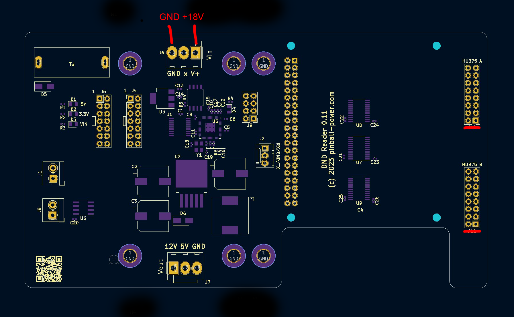

# DMDReader installation guide

## Hardware

### Power supply

Connector J6 markes with "GND x V+" is the power input. On many pinballs, you can get either 12V or 18V DC from the power supply. Check your specific pinball circuit diagrams where to access this. You can also use a standalone power supply. Basically any voltage between 10 and 24V will do the job.

### Fuse

An 3A fuse should be used. If no LED panels are uses, even 2A might work well.

Before connecting the Raspberry Pi, test the power supply. The 3 LEDs below the fuse F1 should light up. If the fuse blows, the power supply polarity is incorrect. If the fuse is ok, but the LEDs still do not light up, the input voltage might be incorrect or missing.

### Raspberry Pi

The Raspberry Pi (any model with a 40-pin connector will do the jobs) will be connected to the 40-pin connector top-down. You should fix it with 10-12mm M2.5 standoffs and screws.

### LED Panels

If you connect LED panels to the board, the connector J7 marked with "12V 5V GND" can be use to power these. Note that LED panels are usually not protected agaoinst wrong polarity and overvoltage. Therefore, make sure you connect to the correct voltage (usually these run at 5V) and polarity. 
Multiple LED panels can either be daisy-chained (if the option is supported by the LED panel) or connected individually to the LED panel data outputs HUB75 A/B. Basically any LED panel with a HUB75 connector should work, but configuration might need to be adjusted.



## Software

### Basic operating system

It is recommended to install the latest "Lite" version of Raspberry Pi OS. Using the Raspberry Pi imager, you can already configure your username, password and WiFi configuration. You should also enable SSH. Once the system has started and you can login via SSH, update the software
```
sudo apt-get update
sudo apt-get -y dist-upgrade
```

### Install the DMDReader software

```
sudo apt-get install -y git
git clone https://github.com/hifiberry/code_dmdreader
```

### Configure config.txt

```
cd code_dmdreader
./pi-configure
sudo reboot
```


